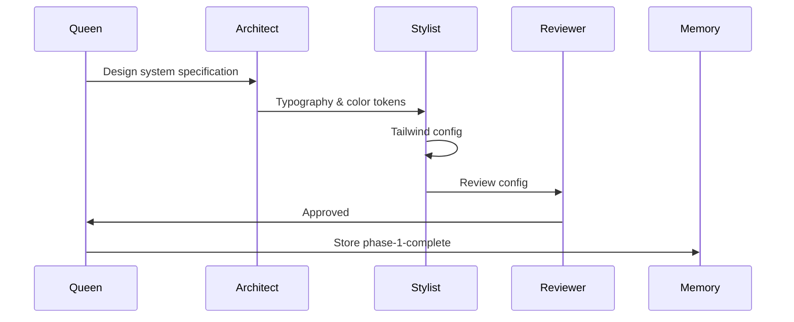
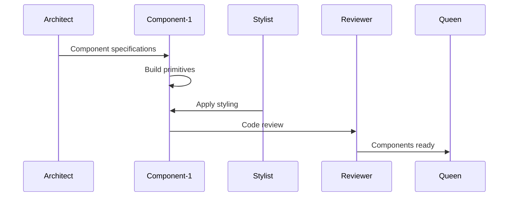
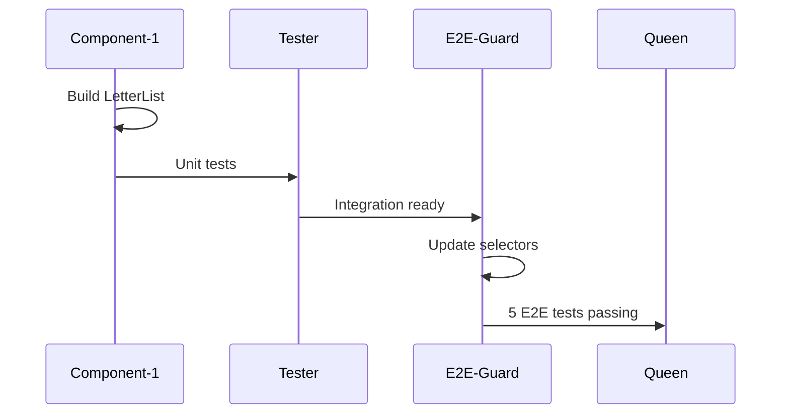
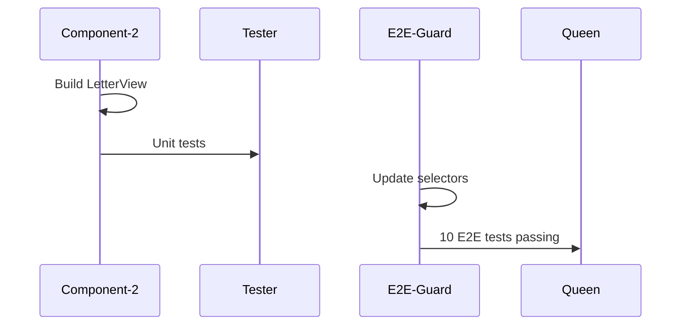
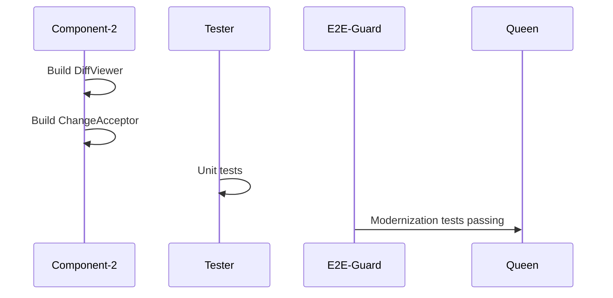
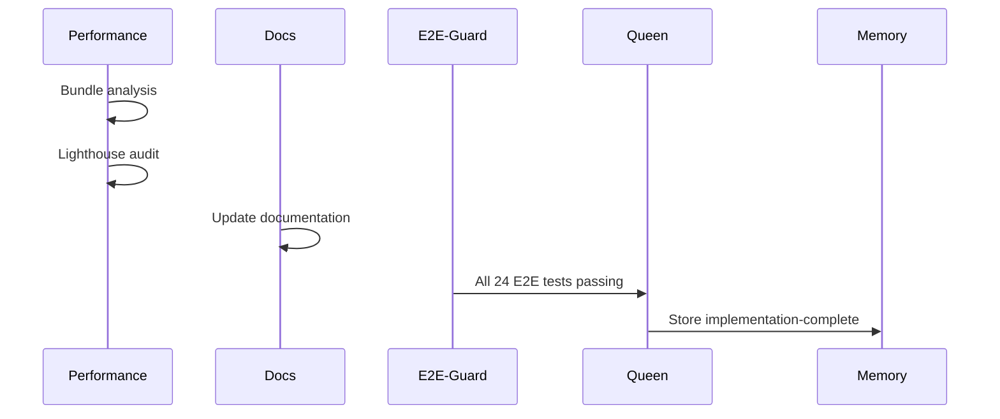

# Swarm Orchestration Plan

## Swarm Configuration

```yaml
swarm_id: swarm-1770963637886
topology: hierarchical-mesh
max_agents: 15
strategy: specialized
consensus: raft
memory_namespace: jernkorset-redesign
```

## Agent Hierarchy

```
                    +------------------+
                    |      QUEEN       |
                    | (coordinator)    |
                    | Model: Sonnet    |
                    +--------+---------+
                             |
        +--------------------+--------------------+
        |                    |                    |
+-------+-------+    +-------+-------+    +-------+-------+
|   ARCHITECT   |    |   REVIEWER    |    |  PERFORMANCE  |
| (design lead) |    | (quality)     |    | (optimization)|
| Model: Sonnet |    | Model: Sonnet |    | Model: Haiku  |
+-------+-------+    +---------------+    +---------------+
        |
        +--------------------+--------------------+
        |                    |                    |
+-------+-------+    +-------+-------+    +-------+-------+
|   STYLIST     |    | COMPONENT-1   |    | COMPONENT-2   |
| (CSS/Tailwind)|    | (List/Table)  |    | (View/Diff)   |
| Model: Sonnet |    | Model: Sonnet |    | Model: Sonnet |
+---------------+    +---------------+    +---------------+
        |                    |                    |
        +--------------------+--------------------+
                             |
        +--------------------+--------------------+
        |                    |                    |
+-------+-------+    +-------+-------+    +-------+-------+
|    TESTER     |    |   E2E-GUARD   |    |     DOCS      |
| (unit/integ)  |    | (playwright)  |    | (documentation|
| Model: Haiku  |    | Model: Haiku  |    | Model: Haiku  |
+---------------+    +---------------+    +---------------+
```

## Phase Execution Sequence

### Phase 1: Foundation
**Active Agents:** Queen, Architect, Stylist, Reviewer



**Checkpoints:**
1. Tailwind configured and building
2. CSS variables defined
3. Fonts loading correctly

### Phase 2: Design System
**Active Agents:** Queen, Architect, Stylist, Component-1, Reviewer



**Checkpoints:**
1. Button, Card, Table components built
2. Skeleton loading states
3. Component tests passing

### Phase 3: LetterList
**Active Agents:** Queen, Component-1, Tester, E2E-Guard, Reviewer



**Checkpoints:**
1. LetterList rendering correctly
2. Pagination working
3. 5 E2E tests passing

### Phase 4: LetterView
**Active Agents:** Queen, Component-2, Tester, E2E-Guard, Reviewer



**Checkpoints:**
1. LetterView rendering correctly
2. Navigation working
3. 10 E2E tests passing

### Phase 5: DiffResolver
**Active Agents:** Queen, Component-2, Tester, E2E-Guard, Reviewer



**Checkpoints:**
1. DiffViewer rendering
2. Change acceptance working
3. 2 E2E tests passing

### Phase 6: Polish
**Active Agents:** Queen, Performance, Docs, E2E-Guard, Reviewer



**Checkpoints:**
1. Bundle < 200KB
2. Lighthouse > 90
3. All 24 E2E tests passing
4. Documentation updated

## Memory Coordination

### Shared Memory Keys
```
jernkorset-redesign/
  ├── jernkorset-current-state      # Initial analysis
  ├── jernkorset-design-direction   # Design decisions
  ├── jernkorset-ddd-domains        # Domain structure
  ├── jernkorset-tech-stack-upgrade # Dependencies
  ├── jernkorset-agent-assignments  # This roster
  ├── phase-1-complete              # Phase checkpoint
  ├── phase-2-complete              # Phase checkpoint
  ├── phase-3-complete              # Phase checkpoint
  ├── phase-4-complete              # Phase checkpoint
  ├── phase-5-complete              # Phase checkpoint
  └── implementation-complete       # Final checkpoint
```

## Task Creation Commands (Reference)

```bash
# These would be created during execution
npx @claude-flow/cli@latest task create --type feature --description "Configure Tailwind CSS 4.0" --priority high
npx @claude-flow/cli@latest task create --type feature --description "Build Button component" --priority high
npx @claude-flow/cli@latest task create --type feature --description "Build LetterList component" --priority critical
npx @claude-flow/cli@latest task create --type bugfix --description "Update E2E selectors" --priority high
```

## Consensus Protocol

For architectural decisions requiring approval:

1. Queen proposes decision
2. Architect and Reviewer vote
3. Majority (2/3) required for approval
4. Decision stored in memory

```bash
# Example consensus flow
npx @claude-flow/cli@latest hive-mind consensus --action propose --type "architecture" --value "Use shadcn Card component"
npx @claude-flow/cli@latest hive-mind consensus --action vote --proposal-id "..." --vote true
```

## Error Recovery

If a phase fails:
1. E2E-Guard reports failing tests
2. Queen identifies root cause
3. Relevant agent fixes issue
4. E2E-Guard re-validates
5. Phase checkpoint updated

## Execution Trigger (DO NOT RUN YET)

```bash
# This is the command to start implementation after plan approval
# DO NOT EXECUTE - This is documentation only

npx @claude-flow/cli@latest swarm init --topology hierarchical-mesh --max-agents 15
# Then spawn agents via Task tool with run_in_background: true
```
