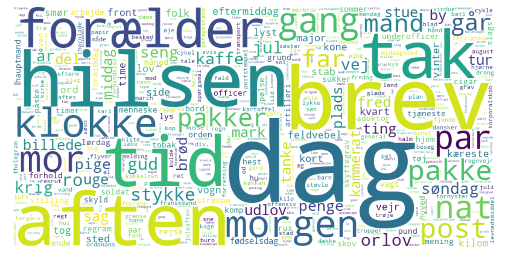
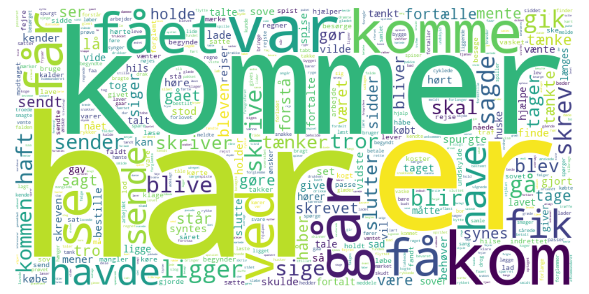

# Jernkorset, breve fra 1911-1918

Denne brevsamling består af 666 breve fra perioden 1911 til 1918, primært fra men også til Peter Mærsk, der under første verdenskrig kæmpede på tysk side som en del af det danske mindretal i sønderjylland.

Dette repos er rådata og nogle python scripts til NLP (natural language processing) og sentiment analysis af brevene.

Det er i høj grad et work in progress.

(Kortet viser afsendelsessteder på brevene og linjerne Peter Mærsks bevægelse gennem Europa under krigen.)

## Historien bag

Peter Mærsk m.fl. skrev brevene.

Else Mærsk, Peters datter, skrev dem ind på sin skrivemaskine i 1990'erne.

Jørgen Dalager, gift med Aase Mærsk Berthelsen, Peters barnebarn har scannet breve, OCR renset dem og konverteret til wordformat og har desuden indsamlet materiale rundt om brevsamlingen.

Christian Dalager, Peters oldebarn (søn af Jørgen og Aase) har lavet http://jernkorset.dk (nogle år siden efterhånden, og lettere broken) hvor brevene er tilgængelige i en browser.

Du kan også downloade dem i epub format til kindle/etc [exports/jernkorset.epub](exports/jernkorset.epub).

De originale breve ligger i dag på det kongelige bibliotek.

## Data

Alle 666 breve: [data/letters.csv](data/letters.csv)

Frekvenstabel for navneord: [data/nounfreq.csv](data/nounfreq.csv)

Frekvenstabel for verber: [data/verbfreq.csv](data/verbfreq.csv)

NER-extracted sted og personnavne: [data/NER_entities.csv](data/NER_entities.csv)

NER-extracted sted- og personnavne, grupperet efter frekvens: [data/NER_entities_grouped.csv](data/NER_entities_grouped.csv)

Sentiment scorede breve [data/sentiment_scored_letters.csv](data/sentiment_scored_letters.csv)

Sætninger (også sentiment scoret) [data/sentiment_scored_sentences.csv](data/sentiment_scored_sentences.csv)

## Status / todo / Work in progress

Der udestår noget arbejde med at få renset data yderligere

- OCR fejl
- Forkortelser kunne godt ensrettes og annoteres
- Der kan være stavefejl i brevene, der skal rettes (skal man overhovedet det?)
- Der nogle breve, der ikke er geocodet.
- Der er nogle breve, der måske er forkert geocodet
- Afsnit, der i htmlteksterne i [letters.csv](data/letters.json) er encodet som double CR/LF + p-tags, skal på en eller anden måde bevares i den html-stripped udgave. Måske er dobbelt crlf nok til at man kan generere en pæn epub bog ud fra [letters.csv](data/letters.csv)

## Scripts

Der ligger en række notebooks, man kan arbejde med og de spytter nogle af data ud, der ligger i data mappen.

# Værktøjer

## Basic NLP

Dacy: https://github.com/centre-for-humanities-computing/DaCy

DaNLP: https://github.com/alexandrainst/danlp/

Spacy: https://spacy.io/models

Lemmy (lemmatizer): https://github.com/sorenlind/lemmy (brugt til at lemmatisere verber)

## Sentiment analysis

Afinn sentiment analysis: https://github.com/fnielsen/afinn

Sentida: https://github.com/guscode/sentida

# Wordclouds

## Navneord

## Verber (alle former)

## Verber (lemmatiseret)

## Personer

## Steder

# 10 tilfældigt udvalgte breve

Som en smagsprøve på brevene, er her 10 tilfældigt udvalgte breve, med trunkeret tekst.

|  id | date       | sender      | recipient   | place                         | location                | text                                                                                                                                                                                                                                                                                                                                                                                                                                                                                                                       |
| --: | :--------- | :---------- | :---------- | :---------------------------- | :---------------------- | :------------------------------------------------------------------------------------------------------------------------------------------------------------------------------------------------------------------------------------------------------------------------------------------------------------------------------------------------------------------------------------------------------------------------------------------------------------------------------------------------------------------------- |
|  25 | 1913-01-26 | Peter Mærsk | Trine Mærsk | Vallekilde                    | 55.743558,11.425181,9   | Min kære lille Trine! Tak for brevet. Nej, det kom slet ikke for tidlig. Jeg er altid så glad ved at hore fra Jer derhjemme. Min første nyhed er nu ikke så glædelig. Det er næmlig at mine papirer er kommen hjem igen fra Altona. Og at de ikke vilde have mig. Der må jo være en der synes jeg skulde lidt længere bort. Så nu er det jo, om jeg ikke får Torn at se. Jeg skal jo hjem på Session i Foråret, blot de så ikke tager mig i 3 år. Men vi vil jo dog ikke håbe det. Ja den gamle er kommen hertil. Og [...] |
|  43 | 1914-01-31 | Peter Mærsk | Mor og far  | Løtzen (Gizycko)              | 54.036405,21.7667341,7  | Kære Forældre. Ja I kan vel nok mærke at vi begynder at få lidt mere tid, da jeg ofte skriver om Lørdagen. Jeg har jo ikke fået Jer brev endnu, men derfor kan jeg jo godt skrive lidt forud, og fortælle lidt om den store fødselsdag. Om eftermiddagen havde vi først fætterspisning, som var rigtig godt, men så pokkers lidt. Derefter gik vi i Konkordia og der gik festen rigtig løs: Der var en stor Statue af Kejseren opstilt i baggrunden på Scenen, og ved begge sider stod der 5 Soldater, og idet tæppe [...] |
|  67 | 1914-06-14 | Peter Mærsk | Mor og far  | Arys (Orzysz)                 | 53.80989,21.9473,6      | Kære Forældre! Tak for pakken og brevet i går. Pakken fik jeg dagen før jeg kom her hen; men jeg stoppede hele pakken i Kogeapparatet, det kunde udmærket gå. Og den er jo god her, for alting er jo doppelt så dyrt her som i Løtzen. Og man kan jo ikke have så meget på oplag, da vi jo ingen Skab har. Vi ligger I8o mand i en hel ny hestestald, hvor vi bliver liggende til den 19, så kommer vi i de rigtige barakker. Men vi vilde næsten hellere blive liggende her, hvor vi er, da det er så lyst og lufti [...] |
|  90 | 1914-09-03 | Peter Mærsk | Mor og far  | Willenberg = Wielbark         | 53.3981483,20.9457569,7 | Kære Forældre. Jeg er sund og rask og helt godt tilpas, jeg har været lidt forkølet i de sidste dage; men nu er det bedre. Jeg har ikke kunnet skrive, da der ingen postforbindelse var; men i dag går der en. Vi ligger tæt ved Allenstein og har slået Russen og taget 10.000 til fange. Hvor længe det hele varer, er jo ikke godt at vide, men Gud give at det snart var ende. I det hele har vi kun været i Ilden tre gange (jeg een gang). Det har været en streng tid de sidste 14 dage, nu siden vi har vund [...] |
| 182 | 1915-08-04 | Peter Mærsk | Mor og far  | Branusberg (Braniewo, Poland) | 54.3797128,19.8200536,5 | Kære Forældre! Tak for pakken igår og brevene og for pakken i dag med Dril-jakken. Den store pakke kom lige tilpas, jeg havde lige op-spist og snakkede om, at nu skulde jeg nok til at leve ved tørt brød, men lille Mor kan altid træffe det. Driljakken har jeg lige syet Gefr.bånd i, og nu har jeg den på, sidder ude i haven i den dejligste Aftenstund og skriver; men det begynder allerede at blive mørk. Jeg er for det meste alene nu, jeg kan ingen rigtig venner træffe mere. Dem der er her som endnu [...]  |
| 389 | 1917-01-20 | Peter Mærsk | Trine Mærsk | Feldbach (Feldburg)           | 47.5359044,7.2649707,8  | Min egen Pige ! Tak for dit Brev i dag. Jeg vilde ellers ikke skrive til dig i aften; men nu er jeg lige ved det, og du skal jo nu helst have en lille Hilsen hver gang jeg tager et stykke Papir og Kovert. Du mente alle de andre kunde sagtens, de havde deres Kæreste så tæt ved, at de kunde tage hen og se til dem. Ja men hvad så dem som har mistet dem for altid. Ja jeg ved jo også nok, at du er på samme mening som jeg, at vi må være glade og taknæmlige, for det vi har det, som vi har det. Jeg tror [...] |
| 425 | 1917-04-02 | Peter Mærsk | Mor og far  | Feldbach (Feldburg)           | 47.5359044,7.2649707,8  | Kære Forældre! Tak for Eders Brev idag, og for to Pakker, de kom jo lige passende til Påske. Jeg har det ellers rigtig gcdt, vi er bægge sunde og raske. I skriver, at I ikke rigtig kan forstå det, at det ikke er Feldw. Mor, der har skikket Kassen tilbage. Jo det er rigtignok en Svigerinde, der er der, hendes Mand er falden; men det var dog kun 8 - 14 dage, hun havde været der. I dag var der en omvæltning igen. En høj Herre fra Gen.Kom. kom og vilde se understaben, og ham fra Marne og Christian M [...] |
| 589 | 1918-03-29 | Peter Mærsk | Mor og far  | Noyon (eller der omkring)     | 49.582413,3.0032579,9   | Poststempel 30. 3. 18. Kære Forældre! En lille Hilsen før jeg går til ro. Jeg har arbejdet hele dagen med at sende Post tilbage fra Komp. af døde - sårede - savnede - ja ikke så godt et arbejde. Jeg tænkte på - hvormeget sorg bereder man dem ikke ved at skrive på Brevene og Pakkerne "død" eller "falden". Vil I ikke undskylde mig hos Morbror Peter at jeg ikke har skrevet før - det har været mig udmulig. Vil I så sige min Trine, om hun vil sende min "Hårdbørste" som jeg sendte hjem. Mange Hilsener [...] |
| 635 | 1918-06-27 | Peter Mærsk | Mor og far  | Vauxcere                      | 49.3407122,3.6371609,12 | Kære Forældre! Tak for Eders to Breve igår og et idag. Det er da godt, at alt er kommen an. Men Kaffe kan jeg ikke få mere, lille Mor. Ellers er alt ved det gamle, vi har det helt godt efter forholdene. Mere i morgen, Posten går af nu. Mange kærlige Hilsener Eders taknæmlige Peter. [...]                                                                                                                                                                                                                           |
| 638 | 1918-07-04 | Peter Mærsk | Mor og far  | Vauxcere                      | 49.3407122,3.6371609,12 | Kære Forældre ! Tak for Pakken idag med Sæbe og Tvebakker, dem må du nok sende mere af, lille Mor. De er helt udmærket at have med i Lommen, er i min Taske på Cyklen, når man er undervejs. Du skriver, at det er sært, at Sukkeret ikke kommer an til Tante Maren. Ja har I ikke fået en lille Sæk med Würfelsukker i, som jeg har sendt af fra Saint du Nord ? Det kunde vel være en 9 Pund, og jeg bad Trine om at give så meget til, at det blev 10, da Konow og jeg har taget lidt deraf, da vi havde slet ikk [...] |
